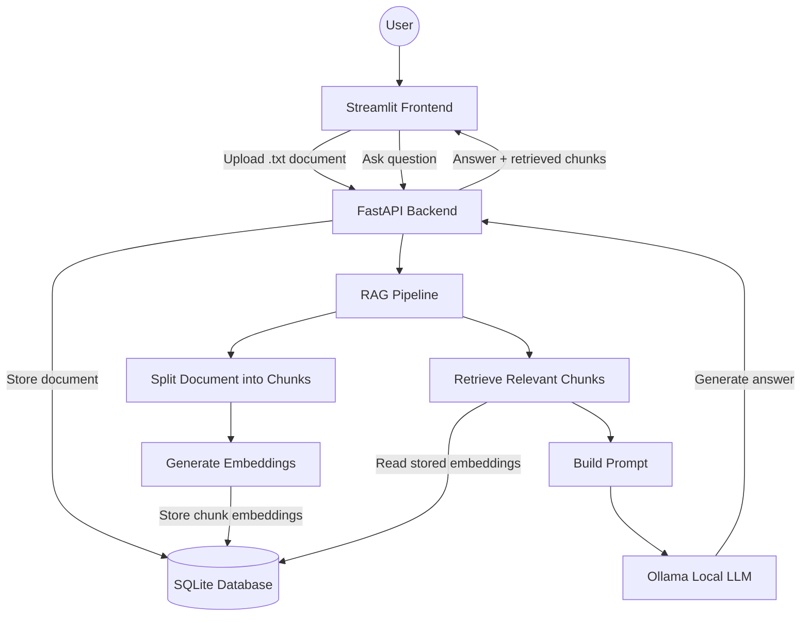

# Local RAG Chatbot

This is a full stack Retrieval Augmented Generation (RAG) Chatbot application that lets users upload documents and ask grounded questions using local embeddings, SQlite storage, FastAPI, Streamlit, and Ollama.

This project was built to better understand how RAG systems work end to end including doucemnt ingesting, chunking, embeddings, semantic retrieval, prompt engineering, and local LLM generation.

---

## Table of Contents

1. [Overview](#overview)
2. [Features](#features)
3. [Tech Stack](#tech-stack)
4. [Architecture](#architecture)
5. [Screenshots](#screenshots)
6. [How It Works](#how-it-works)
7. [Local Setup](#local-setup)
8. [Running the App Locally](#running-the-app-locally)
10. [Usage](#usage)
11. [API Endpoints](#api-endpoints)
12. [Current Limitations](#current-limitations)
13. [Future Improvements](#future-improvements)
14. [License](#license)

---

## Overview

Local RAG Chatbot is a document question/answering application that runs locally. Users upload a '.txt' document thorugh a Streamlit frontend, ask questions about that document, and receive answers gernated by a local Ollama model using retrieved doucument context.

The application is split into a frontend and backend architecture:

- **Frontend:** Streamlit user interface
- **Backend:** FastAPI for document upload, retrieval, and chat
- **Database:** SQLite for storing documents, chunks, and embeddings
- **RAG Pipeline:** Chunking, embeddings, cosine similarity retrieval, and prompt construction
- **LLM:** Ollama running locally

---

## Features

- Upload '.txt' files thorught streamlit frontend
- Store uploaded content in SQlite
- Split documents into chunks for retrieval
- Generate local embeddings using SentenceTransformers
- Store chunk embeddings in SQlite
- Retrieve relevent chunks using cosign similarity
- Generate answers using a local Ollama model using context
- Display retrieved chunks for transparency and debugging purposes
- Fully local  RAG application with no paid API dependency.

---

## Tech Stack

| Layer | Technology |
|---|---|
| Language | Python |
| Backend | FastAPI |
| Frontend | Streamlit |
| Database | SQLite |
| ORM | SQLAlchemy |
| Embeddings | SentenceTransformers |
| Chunking | LangChain Text Splitters |
| Vector Search | NumPy cosine similarity |
| LLM | Ollama |
| Version Control | Git / GitHub |

---

## Architecture

---

## Screenshots

### Document Upload

The frontend allows users to upload a '.txt' document, which is sent to the FastAPI backend for storage, chunking, and embedding.

### RAG Question Answering

After uploading a document, users can ask questions and receive answers generated from retrieved document context.

---

## How it works

1. A User uploads a '.txt' 

---

## Local Setup

*Work in Progess...*

---

## Running the app locally

*Work in progress...*

---

## Usage

*Work in progress...*

---

## API Endpoints

*Work in progress...*

---

## Current Limitations

*Work in Progress...*

---

## Future Improvements

*Work in progress...*

---

## License

This is an open source project and can be used however you want.
