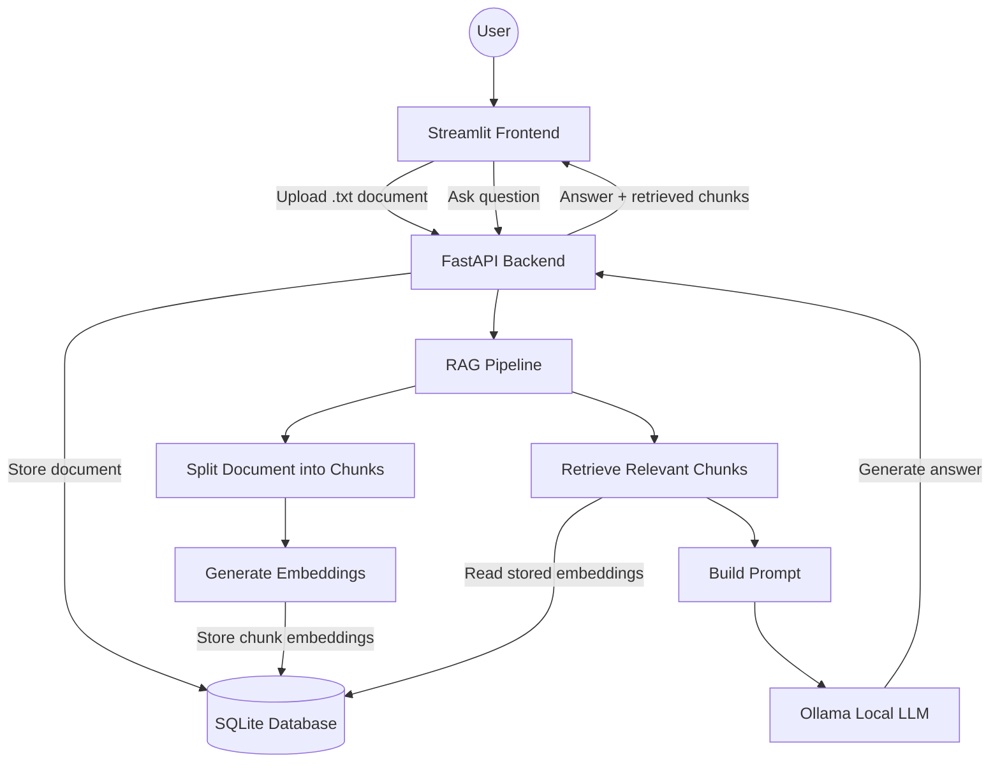

# Local RAG Chatbot

This is a full stack Retrieval Augmented Generation (RAG) Chatbot application that lets users upload documents and ask grounded questions using local embeddings, SQlite storage, FastAPI, Streamlit, and Ollama.

This project was built to better understand how RAG systems work end to end including doucemnt ingesting, chunking, embeddings, semantic retrieval, prompt engineering, and local LLM generation.

---

## Table of Contents

1. [Overview](#overview)
2. [Features](#features)
3. [Tech Stack](#tech-stack)
4. [Architecture](#architecture)
5. [Screenshots](#screenshots)
6. [How It Works](#how-it-works)
7. [Local Setup](#local-setup)
8. [Running the App Locally](#running-the-app-locally)
10. [Usage](#usage)
11. [API Endpoints](#api-endpoints)
12. [Current Limitations](#current-limitations)
13. [Future Improvements](#future-improvements)
14. [License](#license)

---

## Overview

Local RAG Chatbot is a document question/answering application that runs locally. Users upload a '.txt' document thorugh a Streamlit frontend, ask questions about that document, and receive answers gernated by a local Ollama model using retrieved doucument context.

The application is split into a frontend and backend architecture:

- **Frontend:** Streamlit user interface
- **Backend:** FastAPI for document upload, retrieval, and chat
- **Database:** SQLite for storing documents, chunks, and embeddings
- **RAG Pipeline:** Chunking, embeddings, cosine similarity retrieval, and prompt construction
- **LLM:** Ollama running locally

---

## Features

- Upload '.txt' files thorught streamlit frontend
- Store uploaded content in SQlite
- Split documents into chunks for retrieval
- Generate local embeddings using SentenceTransformers
- Store chunk embeddings in SQlite
- Retrieve relevent chunks using cosign similarity
- Generate answers using a local Ollama model using context
- Display retrieved chunks for transparency and debugging purposes
- Fully local  RAG application with no paid API dependency.

---

## Tech Stack

| Layer | Technology |
|---|---|
| Language | Python |
| Backend | FastAPI |
| Frontend | Streamlit |
| Database | SQLite |
| ORM | SQLAlchemy |
| Embeddings | SentenceTransformers |
| Chunking | LangChain Text Splitters |
| Vector Search | NumPy cosine similarity |
| LLM | Ollama |
| Version Control | Git / GitHub |

---

## Architecture



---

## Screenshots

### Document Upload

The frontend allows users to upload a '.txt' document, which is sent to the FastAPI backend for storage, chunking, and embedding.


### RAG Question Answering

After uploading a document, users can ask questions and receive answers generated from retrieved document context.


---

## How it works

1. A user uploads a '.txt' document through the Streamlit frontend.
2. The frontend sends the file to the FastAPI backend.
3. The backend stores the full document in SQLite.
4. The document is split into smaller chunks using a recursive text splitter.
5. Each chunk is converted into an embedding using SentenceTransformers.
6. Chunk text and embeddings are stored in SQLite.
7. When the user asks a question, the question is also embedded.
8. The system compares the question embedding against stored chunk embeddings using cosine similarity.
9. The most relevant chunks are inserted into a RAG prompt.
10. Ollama generates an answer using the retrieved context.
11. The frontend displays the answer and the retrieved chunks.

---

## Local Setup

These instructions are written for Windows PowerShell.

### 1. Clone the repository

```powershell
git clone https://github.com/EvanSmith1016/rag-chatbot.git
cd rag-chatbot
```

### 2. Create and activate a virtual environment

```powershell
python -m venv venv
.\venv\Scripts\Activate.ps1
```

### 3. Install backend dependencies

```powershell
pip install -r backend\requirements.txt
```

### 4. Install frontend dependencies

```powershell
pip install -r frontend\requirements.txt
```

### 5. Install and prepare Ollama

Install Ollama from:

```text
https://ollama.com/download
```

Then pull the local model:

```powershell
ollama pull llama3
```

Confirm the model is available:

```powershell
ollama list
```

---

## Running the App Locally

You need two terminals: one for the backend and one for the frontend.

### Terminal 1: Start the FastAPI backend

From the project root:

```powershell
cd backend
uvicorn app.main:app --reload
```

The backend should run at:

```text
http://127.0.0.1:8000
```

You can check the health endpoint:

```text
http://127.0.0.1:8000/health
```

You can also view the Swagger UI API docs:

```text
http://127.0.0.1:8000/docs
```

### Terminal 2: Start the Streamlit frontend

From the project root:

```powershell
cd frontend
streamlit run app.py
```

The frontend should open at:

```text
http://localhost:8501
```

---

## Usage

1. Start the backend with FastAPI.
2. Start the frontend with Streamlit.
3. Upload a `.txt` document through the frontend.
4. Ask a question about the uploaded document.
5. View the generated answer and retrieved chunks.

Example document:

```text
FastAPI is a modern Python framework used for building APIs.
It supports dependency injection and automatic OpenAPI docs.
SQLite is a lightweight file-based database.
```

Example questions:

```text
What is FastAPI used for?
```

```text
What database is mentioned?
```

---

## API Endpoints

### Health Check

```http
GET /health
```

Returns:

```json
{
  "status": "ok"
}
```

### Upload Document

```http
POST /documents/upload
```

Accepts a `.txt` file and returns:

```json
{
  "document_id": 1,
  "num_chunks": 3
}
```

### Chat

```http
POST /chat/
```

Request body:

```json
{
  "document_id": 1,
  "question": "What is this document about?"
}
```

Response body:

```json
{
  "answer": "The document discusses...",
  "retrieved_chunks": [
    "Relevant chunk text..."
  ]
}
```

---

## Current Limitations

- Only supports `.txt` files
- Does not currently support PDF or DOCX parsing
- Uses SQLite instead of a dedicated vector database
- Stores embeddings as serialized text for MVP simplicity
- Retrieval uses basic cosine similarity
- No user authentication
- No persistent chat history
- No multi-document search yet
- Prompt guardrails are still basic and still need to be refined

---

## Future Improvements

- Add PDF and DOCX document parsing
- Add Docker and Docker Compose support
- Add persistent chat history and sessions
- Improve prompt guardrails to reduce hallucinations
- Add source citations in the UI
- Add multi-document search
- Add FAISS or another vector index for faster retrieval (pretty slow right now)
- Add unit and integration tests with Pytest
- Add CI/CD with GitHub Actions
- Improve frontend layout and add chat history display

---

## License

This is an open source project that was meant for portfolio and learning purposes.
